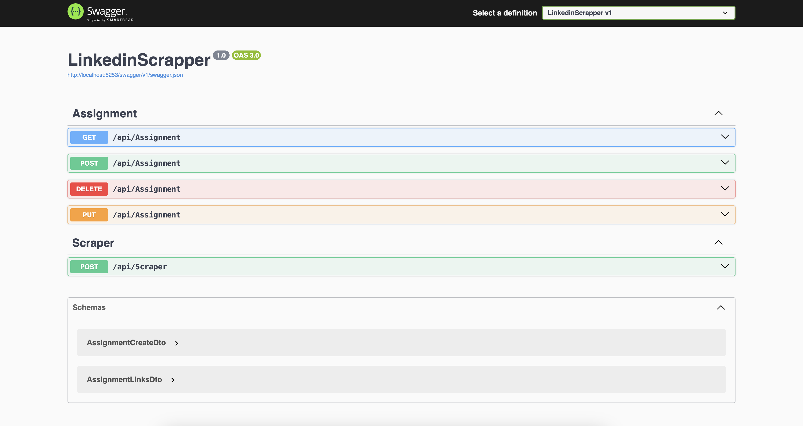
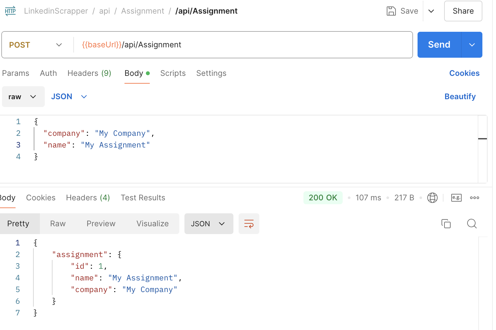
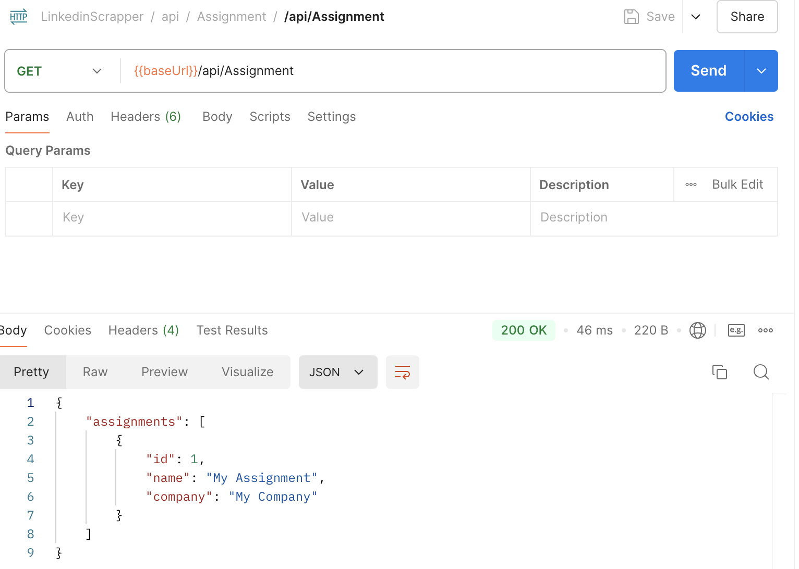
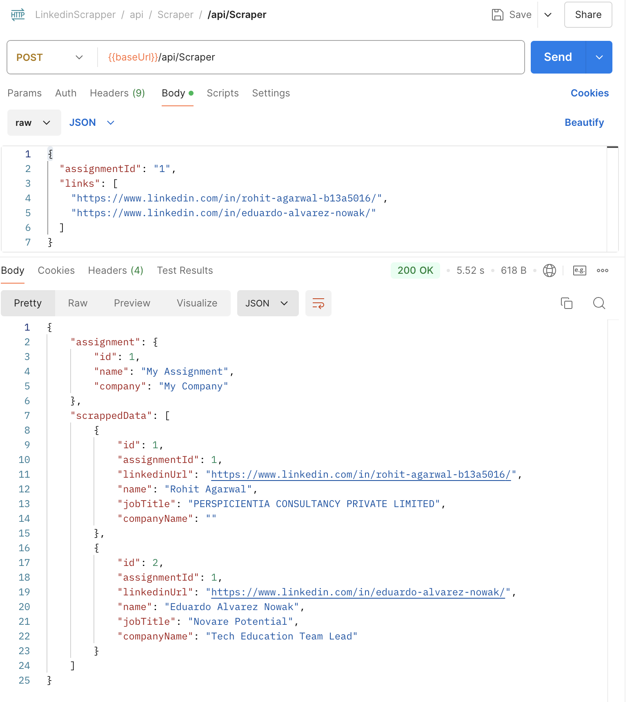

# LinkedIn-profile-scrapper-dotnet

## ASP.NET core WebApi with Entity Framework, in-memory database and swagger

### How to run

    1. install dotnet cli
    2. clone this repository
    3. build project with "dotnet build"
    4. run project with "dotnet run"

### Things you can do

    1. Add assignment with name and company name
    2. Delete assignment
    3. Update assignment
    4. Get all assignments
    5. add linkedin profile urls to an assignment and get profile details like name, company and job title

### Access APIs

    After running the project, APIs could be accessed via swagger on the given url
    http://localhost:5253/swagger/index.html

### Swagger

### Add Assignment

### Get Assignments

### Scrap Linkedin profiles

